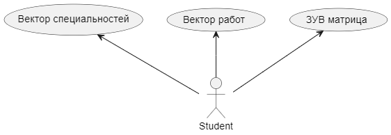

# Описание выходных данных

Студент описывается тремя векторами: 
- вектор специальности $1\times N_{\text{число специальностей}}$
- вектор професий $1\times N_{\text{число професий}}$ 
- матрица ЗУВ $3 \times N_{\text{число предметов}}$, где каждая строка матрицы характеризует на сколько человек знает, умеет и владеет i-ым предметом.

Объекты векторов характеризуют вожность предметов, професий и специальностей для студента.

# Выходные данные

Первые $k$-типов наиболее значимых объектов. Для ЗУВ можно получать значения по отдельным столбцам,

